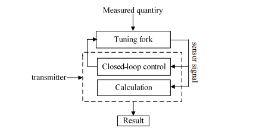
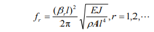
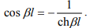
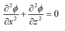
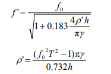
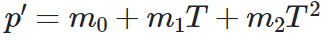
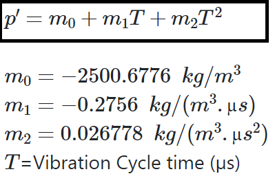
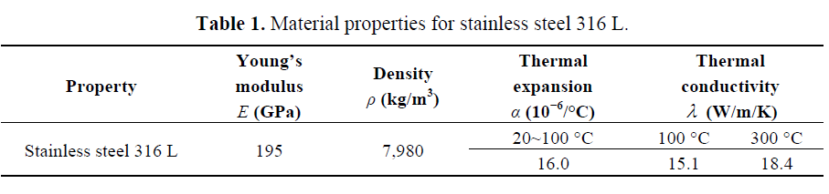
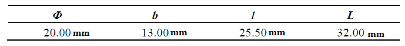

## Density Sensor
### Introduction:

A liquid density measurement sensor with the tuning fork as the sensitive component, which is
based on the resonance principle, is described in this paper and developed to measure density of
liquids, static or in motion. It can measure liquid density directly, being a quasi-digital sensor, which
not only has simple structure, small size, light weight, but also has high precision and reliability.

### Theory Analysis and Simulation
##### Working Principle
The tuning fork liquid density measurement sensor places the tuning fork driven by electromagnetic or piezoelectric method in the measuring chamber, and then the actuator transmits alternating force to the tuning fork to make it vibrate in accordance with its natural frequency. When the tuning fork contacts with the liquid measured, the added mass of the tuning fork changes, and results in vibration 
frequency (vibration cycle) changes. The detector picks up the vibration signal to detect the vibration frequency. By measuring the changes of the natural frequency or vibration cycle, the density of the liquid tested can be determined. Therefore, it is very important to obtain the natural frequency of the tuning fork exactly to ensure the excellent performance of the sensor.
The sensor is composed of the sensitive unit and the closed-loop control unit, where the sensitive unit consists of the actuator, the resonant tuning fork and the detector. Resonant tuning fork senses the liquid density directly, and the detector sends the signal which carries measurement information forward to the closed-loop control unit for processing and output density value, while the closed-loop 
control unit output excitation signal to control the actuator and then drive the tuning fork. The basic configuration of the sensor is shown in Figure. 

##### Resonant Frequency of the Tuning Fork 
As can be seen from the analysis above, the natural frequency of the tuning fork has important impact on the performance of the sensor. In this part of the paper, an approximate parameters model of the tuning fork is established, and the impact of liquid density, position of the tuning fork, temperature and structural parameters on the natural frequency of the tuning fork are also analyzed both theoretically and by simulation. 

The vibration of a tuning fork can be equivalent to the vibration of a cantilever beam. The vibration frequency can be obtained from calculating Euler Equation and described as follows: 

 
where ρ is mass per unit volume, A is cross sectional area, l is the length, EJ is bending rigidity of the cross section, and βl can be calculated from the equation

Equation (1) shows that the vibration frequency of the cantilever beam relates to the cross-sectional area and the length.

##### Resonant Frequency Dependence on Liquid 

Through the study on vibration of free-free beams under liquid, it is assumed that the liquid is ideal, incompressible and without spin, and based on the Laplace equation:

we can get the liquid velocity potential function (x,z,t), and the changes of vibration frequency of a cantilever beam when the depth of the beam in the liquid changes. On this basis, we also have introduced the change of the first-order vibration frequency of the tuning fork when the depth in the liquid changes or the liquid density changes, as given by Equation (3) below: 

where f0 is natural frequency of the tuning fork in the air, ρ' is the liquid density, T is the vibration
cycle of the tuning fork, 

 ,h is the depth of the tuning fork into the liquid, and γ is density of the
tuning fork per unit width. When the depth of the tuning fork in the liquid is fixed, the vibration
frequency decreases as the liquid density increases.

The follow equation is often used to calculate the liquid density:
 

are the sensor coefficients which can be determined through calibration experiments.
##### Tunning fork model
Stainless steel 316 L, whose material properties are shown in Table 1, was used to make the tuning
fork. The tuning fork is fabricated through finish machining technology with the specific dimensional
parameters. The actuator and detector are a pair of distributed bi-piezoelectric
actuators with simple structure and low power consumption. The bi-piezoelectric actuators are
symmetrical, perpendicular to the tuning fork,

(a) Front view of the tuning fork; (b) Left view of the tuning fork; ( c ) Back view
of the tuning fork (unit: mm).

The tuning fork and is supported by a flange whose stiffness is The flange does not vibrate, therefore, it does not affect the liquid density measurement process.

  